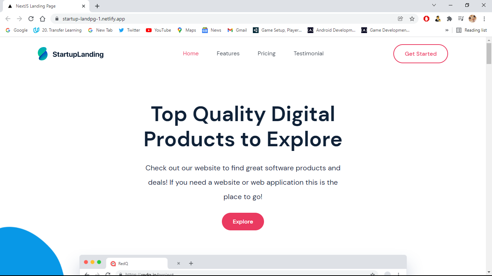

## Table of contents

- [Getting Started](#Getting_Started)
- [Overview](#overview)
  - [Screenshot](#screenshot)
  - [About](#About)
  - [Livesite](#Live_site)
- [Author](#author)

## Getting_Started

Install the dependencies and run the development server

```bash
npm install
npm run dev
# or
yarn
yarn dev
```

## Overview

### Screenshot



### About

This is a Landing page template created with nextjs react. Users can build upon the template and customize for their desired business page or startup

### Live_site

-Live Site URL: [live site](https://startup-landpg-1.netlify.app)

## Author

- Website -[Ibrahim Shittu](https://iam-ibrahim.netlify.app/)
- Twitter - [@iamDbest21](https://www.twitter.com/@iamDbest21)
